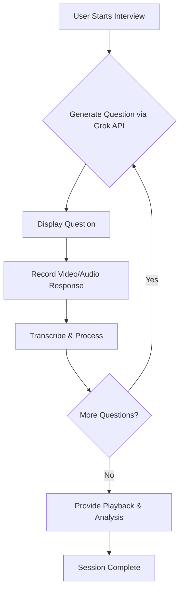

# PrepAI 🎓🤖

[](https://www.python.org/)
[](https://flask.palletsprojects.com/)
[]()
[](LICENSE)
[](https://github.com/suhanpahari/PrepAI/issues)
[](https://github.com/suhanpahari/PrepAI/stargazers)

> **PrepAI** is an AI-powered **interview preparation platform** that simulates real-time interviews with **video, audio, and AI-generated questions**.
> It records your responses, analyzes performance, and helps you practice effectively in an interactive environment.

---

## ✨ Features
- 🎤 **AI-driven mock interviews** with live video/audio
- 📑 **Dynamic question sets** powered by Grok API
- 🎥 **Automatic recording & playback** of interview sessions
- 🌐 **Web-based interface** – no extra installation needed
- 📊 **Performance insights** for self-improvement

---

## 📦 Tech Stack


---

## 🔧 How It Works

PrepAI follows a seamless, automated workflow to simulate a real interview experience:

1.  **Start Session**: User launches the app and grants camera/microphone permissions.
2.  **Generate Questions**: The backend uses the **Grok API** to generate a dynamic set of interview questions.
3.  **Present Question**: A question is displayed on the screen and the user is prompted to answer.
4.  **Record Response**: The system simultaneously records the user's **video and audio** response.
5.  **Process & Analyze**: The recorded audio is transcribed (using Whisper or similar) for future analysis features.
6.  **Next Question**: The cycle repeats for the next question in the set.
7.  **Review & Playback**: At the end of the session, the user can review their entire recorded performance.

This closed-loop system provides a powerful platform for self-assessment and improvement.



---

## 📂 Project Structure

```
PrepAI/
├── .gitignore
├── LICENSE
├── README.md
├── app.py                      # Main Flask application (primary)
├── app_t.py                    # Main Flask application (alternative)
├── main.py                     # Legacy/utility script
├── main_t.py                   # Legacy/utility script
├── ocean_vdo.py                # Video processing module
├── requirments.txt             # Project dependencies
├── voice.py                    # Voice/TTS processing module
├── whis.py                     # Whisper transcription module
├── interview_recording.webm    # Example recording (gitignored in practice)
├── temp_audio.wav              # Temporary audio file (gitignored)
├── vdo.h5                      # Data file (gitignored)
├── desktop.ini                 # System file (gitignored)
│
├── __pycache__/                # Python cache directory
├── question_set/               # Directory for question data
├── src/                        # Additional source code
├── static/                     # CSS, JS, images
│   └── style.css               # Main stylesheet
├── templates/                  # HTML templates
│   ├── index.html              # Main landing page
│   └── interview.html          # Interview interface page
└── videos/                     # Directory for stored user recordings
```

---

## ⚙️ Installation & Setup

1.  **Clone the repository**
    ```bash
    git clone https://github.com/suhanpahari/PrepAI.git
    cd PrepAI
    ```

2.  **Set up a virtual environment (recommended)**
    ```bash
    python -m venv venv
    source venv/bin/activate  # On Windows: venv\Scripts\activate
    ```

3.  **Install dependencies**
    ```bash
    pip install -r requirments.txt
    ```

4.  **Configure Environment Variables**
    Create a `.env` file in the project root and add your Grok API key:
    ```env
    GROK_API_KEY=your_actual_api_key_here
    ```

5.  **Run the application**
    ```bash
    python app_t.py
    # or
    python app.py
    ```

6.  **Open in browser**
    Navigate to `http://localhost:5000` (or the specified address in the terminal).
    Allow **camera & microphone access** when prompted → Start your interview! 🚀

---

## 🖼️ UI Preview


*The live interview interface with a question prompt, timer, and video feed.*

---

## 🎬 Demo Video

A full demonstration of the PrepAI workflow, from starting the interview to reviewing the recording.

[▶ **Watch the full demo video on Google Drive**](https://drive.google.com/file/d/14pLjoeeXmaWpVqb5PBax5YMzAZW4d-AB/view?usp=sharing)

---

## 👥 Contributors

This project was brought to life by:

*   **Mansha Chaudhary**
*   **Pradumn Pandey**
*   **Dr. S.C. Kumain** (Guide)
*   **Suhan Pahari** *(Maintainer)*

---

## 📜 License

This project is licensed under the MIT License. See the [LICENSE](LICENSE) file for details.
